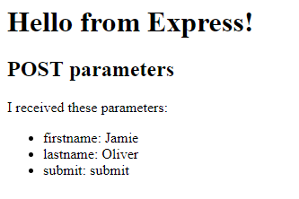

# Examine HTTP

Web applications are based on the client and server communicating with each other using the HTTP protocol.

Implementing a server is rather simle with Node.js and the Express framework. In this exercise we are going to implement a small client and a small server to get familiar with what happens under the hood of web applcations.

## Exercise

There is a small client (=web page) in folder `public` that sends forms to a server on the same host. Your task is to implement the server according to the specification below.

1. First, create file _app.js_ in the root of the project and set up an Express-server.
    > Please refer to Express.js documentation.
   
2. We need to make the client available for use. Make the client page available at the root of the server. 
    
    > Express can easily be configured to serve static |pages. Please refer to the Express framework documentation to find out how to do it:<https://expressjs.com/en/starter/static-files.html>.

3.  Implement handling for _GET request without parameters_, _GET request with query parameters_ and _Form with GET method_. Your server should respond to the request with status 200 and text that contains all the request parameters and 
their values in JSON format. 

3.   Make your server report to the server console:
        - the request type and path requested
        - all the parameters of the request (so called GET parameters) line by line if form _key: value_. 
    Example:
```
GET /api/exercise
GET /api/exercise
number1: 345
number2: 987
submit: submit
```

4.  Implement handling for _Form with POST method_ and _Another form with POST method_. Your server should respond to the requests with status 200 and HTML page that shows all the request parameters and 
their values in to the user like in this example:

    

    ```html
    <h1>Hello from Express!</h1>
    <h2>POST parameters</h2>
    <p>I received these parameters: </p>
    <ul>
        <li>firstname: Jamie</li>
        <li>lastname: Oliver</li>
        <li>submit: submit</li>
    </ul>
    ```

    Note: List the parameters in the same format as in the example as list items, otherwise the automated tests will fail.

5. Implement handling for the login form. Your server should:
    * respond with status 400 if either username of password is missing
    * respond with status 200 and an object { user: _username_ } in JSON format if the username is "mark" and the password is "giraffe".
    * respond with status 403 in any other case.

## Questions
Answer these questions in a text file:
1. What is the meaning of the  HTTP request types (_HTTP verbs_) GET, POST, PUT, and DELETE?  
2. HTTP responses always include a status code. What are the possible response codes and what do they mean?
3. How can parameters be sent in a GET request? How are they transferred in HTTP?
4.  How can parameters be sent in a POST request? How are they transferred in HTTP?

## Instructions

Please refer to the Express.js documentation. As Express is such a widely used framework there are also many other sources, e.g.

-   Reading request parameters is described e.g. in <https://flaviocopes.com/express-request-parameters/>

-   Here is an article about why you need a body parser and what it does: <https://medium.com/@adamzerner/how-bodyparser-works-247897a93b90>
# examine_http
